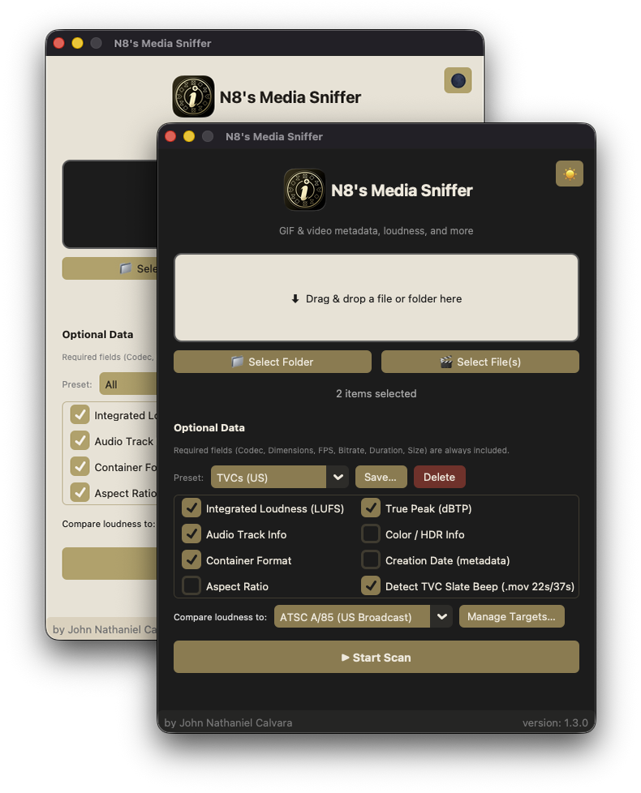

# Media Scanner GUI (GIF & Video)

<div align="center">
  
</div>

# Releases

Stable release is available on Windows (x64) & MacOSX (Apple Silicon/ARM & Intel/86_64x).

Download and check the latest release [here](https://github.com/n8ventures/MediaSniffer/releases/latest).

or just directly download here without worry:

[OSX (ARM/Apple Silicon)](https://github.com/n8ventures/MediaSniffer/releases/latest/download/MacOS-arm64-N8.s.Media.Sniffer.Installer-1.3.0.zip)

[OSX (Intel/86_64x)](https://github.com/n8ventures/MediaSniffer/releases/latest/download/MacOS-x86_64-N8.s.Media.Sniffer.Installer-1.3.0.zip)

[Windows](https://github.com/n8ventures/MediaSniffer/releases/latest/download/N8sMediaSniffer.exe)

## Technicalities

Two files:

- `media_core.py` — all non-GUI logic: binary resolution, ffprobe/ffmpeg
  wrappers, metadata + loudness extraction, report builders.
- `mainGUI.py` — the CustomTkinter application.

## Setup

```
pip install r requirements.txt
```

- **tkinterdnd2** is optional — without it, drag-and-drop is disabled and
  the drop zone shows a note, but the folder/file buttons work fine. Swap
  in your own patched hybrid class in `mainGUI.py` — the `_CTkDnD` block
  near the top is clearly marked and everything else only depends on
  `AppBaseClass` / `DND_FILES`.
- **python-docx** is only needed for the DOCX "Save As" option.

## What it does

- Drop or select a file/folder → walks it for `.gif` + video files only
  (no plain audio files, per your ask).
- Required fields (always shown, not checkboxes): **Codec, Dimensions,
  FPS, Bitrate, Duration, Size**. Duration is frame-accurate
  (`H:MM:SS:FF`), using ffprobe's exact frame count when available.
- Optional checkboxes:
  - **Integrated Loudness (LUFS)** and **True Peak (dBTP)** — via
    ffmpeg's `ebur128` filter (full audio decode, so it's opt-in). Files
    with no audio track (most GIFs, silent clips) show `N/A` instead of
    running the analysis.
  - **Audio Track Info** — codec/channels/sample rate, when present.
  - **Color / HDR Info** — bit depth, color primaries, and HDR10(PQ)/HLG/SDR
    detection from `color_transfer`.
  - **Container Format** — e.g. "QuickTime / MOV".
  - **Creation Date** — from container metadata tags, if present.
  - **Aspect Ratio** — from stream data, or computed from dimensions.
- Scanning runs in a background thread with a modal progress popup
  (file-by-file), so the UI never freezes — this matters especially with
  LUFS analysis on, since that's a full decode per file.
- Results open in a separate scrollable, grouped-by-folder window. Bottom
  bar: **Save As** (HTML / Markdown / DOCX / TXT) and **Exit**.
